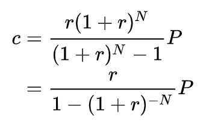

# MortgageCalculator

View the hosted solution: <a href='https://mortgagepaymentcalculatorbysid.web.app/'>https://mortgagepaymentcalculatorbysid.web.app/ [(Demo)](https://mortgagepaymentcalculatorbysid.web.app/ )</a>
 
This project was generated with [Angular CLI](https://github.com/angular/angular-cli) version 10.0.7.

## Inspirations:
<ul>
  <li><a href="https://itools-ioutils.fcac-acfc.gc.ca/MC-CH/MCCalc-CHCalc-eng.aspx">Mortgage Calculator from Government of Canada</a></li>
  <li><a href="https://apps.royalbank.com/apps/mortgages/mortgage-payment-calculator/">Mortgage Calculator from Royal Bank of Canada</a></li>
 </ul>
 
 ## Formula
 

r = the monthly interest rate

P = the amount borrowed, known as the loan's principal

c = monthly payment

reference formula for monthly payment = "c = P[r(1+r)^n]/[(1+r)^n -1]"

<a href="https://en.wikipedia.org/wiki/Mortgage_calculator">https://en.wikipedia.org/wiki/Mortgage_calculator (Document)</a>

## Things I considered while solving this problem

<ul>
  <li>Basic functionality of the mortgage calculator.</li>
  <li>Branding of the RBC</li>
  <li>Mobile, tablet responsive</li>
  <li>Accessibility of the calculator (WCAG 2.1 AA / AODA) guideline</li>
  <li>Keyboard accessible</li>
  <li>Test cases for the input field</li>
  <li>Form validation</li>
  <li>Better user interface and user experience (UI/ UX)</li>
  <li>Hosted this calculator via firebase <a href='https://mortgagepaymentcalculatorbysid.web.app/'>https://mortgagepaymentcalculatorbysid.web.app/</a></li>
 </ul>

## Development server

Run `ng serve` for a dev server. Navigate to `http://localhost:4200/`. The app will automatically reload if you change any of the source files.

## Code scaffolding

Run `ng generate component component-name` to generate a new component. You can also use `ng generate directive|pipe|service|class|guard|interface|enum|module`.

## Build

Run `ng build` to build the project. The build artifacts will be stored in the `dist/` directory. Use the `--prod` flag for a production build.

## Running unit tests

Run `ng test` to execute the unit tests via [Karma](https://karma-runner.github.io).

## Running end-to-end tests

Run `ng e2e` to execute the end-to-end tests via [Protractor](http://www.protractortest.org/).

## Further help

To get more help on the Angular CLI use `ng help` or go check out the [Angular CLI README](https://github.com/angular/angular-cli/blob/master/README.md).
